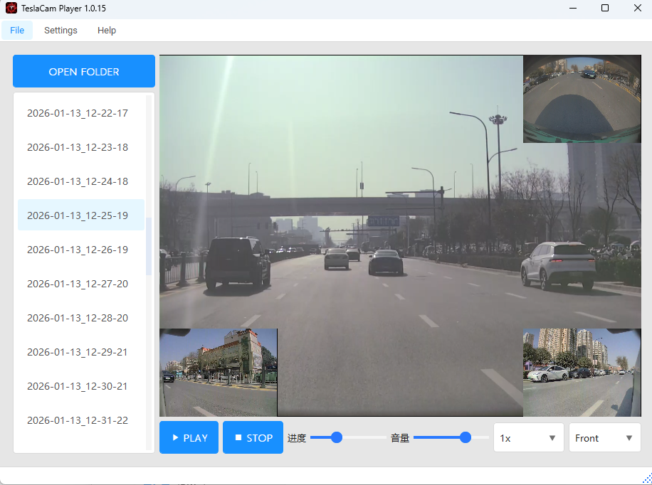

# TeslaCamPlayer

[](https://github.com/JerryYu2014/TeslaCamPlayer/actions/workflows/ci.yml)
[](https://github.com/JerryYu2014/TeslaCamPlayer/actions/workflows/create-release-tag.yml)
[](https://github.com/JerryYu2014/TeslaCamPlayer/actions/workflows/release.yml)

TeslaCamPlayer is a desktop player and manager for Tesla dashcam (TeslaCam / Sentry Mode) video files. 
It is built with Python and PyQt5, providing a cross‑platform GUI to quickly browse, preview, and export TeslaCam clips.



> 中文说明：请参见 [README.md](README.md)

---

## Features

- **Browse & play TeslaCam videos**  
  Load loop recording and Sentry Mode footage from TeslaCam USB drives or copied folders, and play clips continuously.
- **Multi‑view playback**  
  Use `python-vlc` and `ffmpeg-python` under the hood to support multiple video streams and timeline control.
- **Clip export & merge**  
  Export selected time ranges as a single merged video via the dedicated "Merge & Export" dialog, making it easy to submit evidence to insurers / police or share with friends.
- **Modern desktop UI with multi‑language support**  
  PyQt5 + qt-material + QtAwesome provide a Material‑style, modern desktop interface; the app ships with both Chinese and English UIs, auto‑detects system language by default, and allows manual switching under "Settings → Language" with the selection persisted in the config file.
- **Notification settings**  
  Supports configurable notification channels, including system notifications, email, and WeCom (WeChat Work) bots for important events such as export completion. On Windows, this can be combined with `win11toast` for native toast notifications.
- **Built‑in update check & download dialog**  
  "Help → Check for Updates" talks to the GitHub Releases API. When a new version is available, a separate non‑blocking download dialog shows real‑time progress, the download URL (with a **Copy** button), the local save path (with an **Open Folder** button), and a dedicated HTTP proxy setting used only for update downloads.

> The actual feature set depends on the released version. See `MainWindow.py` and `TeslaCamPlayerWidget.py` for the main entry points and UI logic.

---

## Tech Stack

- **Language & runtime**  
  - Python 3.9+ (recommended; adjust to your local environment)
- **GUI & UI**  
  - PyQt5 (`PyQt5`)
  - qt-material (`qt-material`)
  - QtAwesome (`QtAwesome`)
- **Media & video processing**  
  - python-vlc (`python-vlc`)
  - ffmpeg-python (`ffmpeg-python`)
- **Utilities & OS integration**  
  - win11toast (Windows notifications)
  - requests (network requests, e.g. for checking updates or downloading resources)
- **Packaging & distribution**  
  - PyInstaller (`pyinstaller`)
  - Windows installer: NSIS (EXE installer)
  - macOS: PyInstaller‑built app bundled into DMG images

See `requirements.txt` for the full list of dependencies.

---

## Project Structure (Simplified)

```text
TeslaCamPlayer/
├─ src/
│  ├─ MainWindow.py              # Main application window
│  ├─ TeslaCamPlayerWidget.py    # Main player / manager UI
│  ├─ CoreWorker.py              # Background tasks and core logic
│  ├─ CamClipCombiner/           # Video clip merger
│  │  ├─ CamClipCombinerWin.py   # Merge dialog UI
│  │  └─ CoreWorker.py           # Core merge logic
│  ├─ ThemeManager.py            # Theme & style management
│  ├─ GlobalConfig.py            # Global configuration
│  ├─ notifier.py                # Notification helpers
│  ├─ utils.py                   # Utility helpers
│  └─ assets/                    # Icons and resources
├─ requirements.txt
├─ TeslaCamPlayer.spec           # PyInstaller spec file
├─ TeslaCamPlayer.nsi            # NSIS script (Windows)
└─ README.md / README-en_US.md
```

---

## Getting Started (Development)

### 1. Create & activate a virtual environment (recommended)

#### Install virtualenv

```bash
pip3 install virtualenv

py -3 -m pip install virtualenv
```

#### Create a virtual environment

```bash
virtualenv venv

py -3 -m virtualenv venv
```

#### Activate the virtual environment

```bash
# macOS / Linux:
source ./venv/bin/activate

# Windows (CMD or PowerShell):
.\venv\scripts\activate
```

#### Deactivate the virtual environment

```bash
deactivate
```

### 2. Install dependencies

From the project root:

```bash
# Default index
pip install -r requirements.txt

# Aliyun mirror
pip install -r requirements.txt -i https://mirrors.aliyun.com/pypi/simple/ --trusted-host mirrors.aliyun.com

# Tsinghua mirror
pip install -r requirements.txt -i https://pypi.tuna.tsinghua.edu.cn/simple --trusted-host pypi.tuna.tsinghua.edu.cn

# Official index with proxy
pip install -r requirements.txt -i https://pypi.org/simple/ --trusted-host pypi.org --proxy http://127.0.0.1:1081

# Install ffmpeg-python separately if needed
pip install ffmpeg-python
```

#### Uninstall dependencies (optional)

```bash
pip uninstall -r requirements.txt

pip uninstall python-ffmpeg
```

> Note: You must have FFmpeg installed on your system, and the `ffmpeg` binary should be available in your `PATH` for export/merge features to work.

---

## Run from Source

1. Clone the repository:

   ```bash
   git clone https://github.com/<your-name>/TeslaCamPlayer.git
   cd TeslaCamPlayer
   ```

2. (Optional) create & activate a virtual environment, then install dependencies:

   ```bash
   py -3 -m venv .venv
   .\.venv\Scripts\activate
   pip install -r requirements.txt
   ```

3. Run the main application:

   ```bash
   # Windows
   py -3 src/MainWindow.py

   # Other platforms
   python src/MainWindow.py
   ```

4. Insert the USB drive (or choose a local folder) that contains the TeslaCam directory structure, then select the path in the app and start browsing/playing.

---

## Build Executables & Installers

### 1. Build executables with PyInstaller

Make sure PyInstaller is installed (it is listed in `requirements.txt`):

```bash
pip install pyinstaller
```

#### Windows examples

```bash
# One-file mode (slower startup time)
pyinstaller --onefile src/MainWindow.py --noconfirm --name "TeslaCamPlayer"

# GUI app, hide console window
pyinstaller src/MainWindow.py --windowed --noconfirm --name "TeslaCamPlayer"

# Strip debug symbols, reduce size
pyinstaller src/MainWindow.py --windowed --noconfirm --strip --name "TeslaCamPlayer"

# Add icon and resources
pyinstaller src/MainWindow.py --windowed --noconfirm --strip --name "TeslaCamPlayer" --add-data "src/assets/*:assets" --icon="src/assets/logo.ico"

# Use the spec file (recommended for consistent builds)
pyinstaller --noconfirm TeslaCamPlayer.spec
```

#### macOS examples

```bash
# One-file mode
pyinstaller --onefile src/MainWindow.py --noconfirm --name "TeslaCamPlayer"

# GUI app
pyinstaller src/MainWindow.py --windowed --noconfirm --name "TeslaCamPlayer"

# Strip debug symbols
pyinstaller src/MainWindow.py --windowed --noconfirm --strip --name "TeslaCamPlayer"

# Icon and resources
pyinstaller src/MainWindow.py --windowed --noconfirm --strip --name "TeslaCamPlayer" --add-data "src/assets/*:assets" --icon="src/assets/logo.ico"

# Use the spec file
pyinstaller --noconfirm TeslaCamPlayer.spec
```

> Adjust the `--add-data` paths and icon file according to your actual directory layout and platform.

#### GitHub Actions auto-published artifacts

When you push a tag like `v1.0.x` to GitHub, the `C.Build and Release` workflow runs automatically and publishes installable artifacts to the corresponding GitHub Release:

- **Windows**:
  - `TeslaCamPlayer X.Y.Z_Setup.exe` — NSIS installer for Windows.
- **macOS**:
  - `TeslaCamPlayer-macOS-X64.dmg` — DMG for Intel Macs.
  - `TeslaCamPlayer-macOS-ARM64.dmg` — DMG for Apple Silicon Macs.

End users can simply download the DMG that matches their Mac architecture from the Releases page and install the app.

### 2. Build installers

#### Windows: NSIS installer

- Install [NSIS](https://nsis.sourceforge.io/Main_Page).
- Use the `TeslaCamPlayer.nsi` script in this repository to generate a Windows installer.

#### macOS

For macOS, the recommended distribution format in CI is DMG (one for Intel and one for Apple Silicon) as described above. If you prefer other packaging formats (such as pkg), you can build them on top of the PyInstaller‑generated app bundle according to your own deployment requirements.

---

## License

This project is open-sourced under the [MIT License](LICENSE). Contributions via issues and pull requests are welcome.
