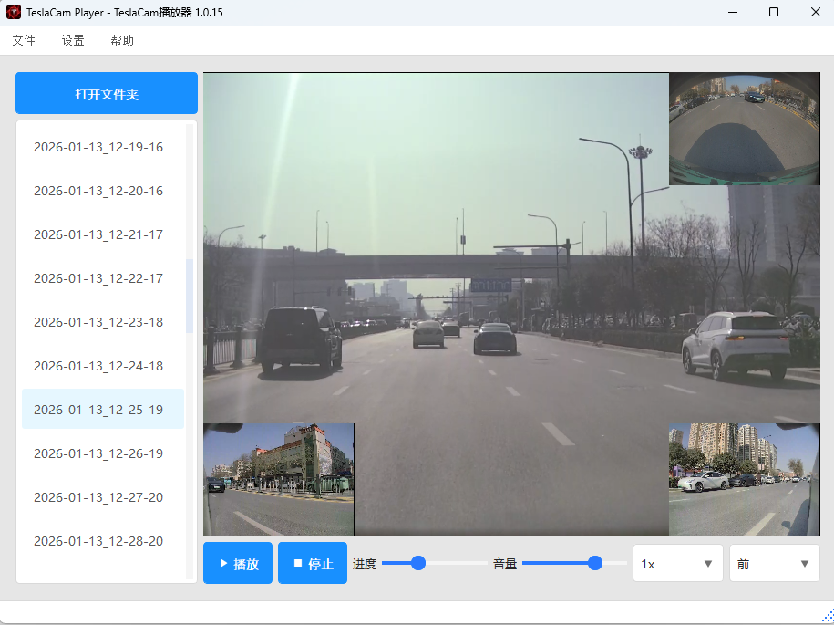

# TeslaCamPlayer

[](https://github.com/JerryYu2014/TeslaCamPlayer/actions/workflows/ci.yml)
[](https://github.com/JerryYu2014/TeslaCamPlayer/actions/workflows/create-release-tag.yml)
[](https://github.com/JerryYu2014/TeslaCamPlayer/actions/workflows/release.yml)

TeslaCamPlayer 是一个针对特斯拉行车记录仪（TeslaCam / Sentry Mode）视频文件的桌面播放器与管理工具，基于 Python 与 PyQt5 构建，提供跨平台的图形界面，方便地浏览、预览和导出 TeslaCam 片段。



> English README: [README-en_US.md](README-en_US.md)

---

## 功能简介

- **TeslaCam 视频浏览与播放**  
  读取 TeslaCam/U 盘中的循环录像、哨兵模式文件，支持多片段连续播放。
- **多窗口/多视角支持**  
  结合 `python-vlc` 与 `ffmpeg-python`，实现多路视频播放和时间轴控制。
- **片段导出与合并**  
  通过合成导出对话框，将选定时间段的一组多视角画面合成为单个视频文件，便于提交保险/交警或分享。
- **现代化桌面 UI 与多语言支持**  
  使用 PyQt5 + qt-material + QtAwesome，提供类 Material 风格的桌面界面；内置中英文界面，默认跟随系统语言，也可在「Settings → Language」中手动切换，并将选择保存到配置文件。
- **系统通知与提醒**  
  支持配置系统通知、邮件和企业微信机器人通知（如合成导出完成时提醒）；在 Windows 上结合 `win11toast` 提供系统级通知。
- **内置更新检查与下载**  
  通过「Help → Check for Updates」调用 GitHub Releases API 检查新版本，可在应用内弹出独立的下载进度窗口，显示下载进度、下载链接与保存路径，支持复制链接、打开文件夹以及为更新下载单独配置 HTTP 代理。

> 具体功能以实际发布版本为准，源码中 `MainWindow.py` / `TeslaCamPlayerWidget.py` 为主要界面与逻辑入口。

---

## 核心技术栈

- **语言与运行环境**
  - Python 3.9+（建议，具体以你本地环境为准）
- **GUI 与界面相关**
  - PyQt5 (`PyQt5`)
  - qt-material (`qt-material`)
  - QtAwesome (`QtAwesome`)
- **多媒体与视频处理**
  - python-vlc (`python-vlc`)
  - ffmpeg-python (`ffmpeg-python`)
- **系统体验与工具**
  - win11toast（Windows 通知）
  - requests（网络请求，若需要在线检查更新或下载资源）
- **打包与分发**
  - PyInstaller (`pyinstaller`)
  - Windows：NSIS 安装包（EXE 安装程序）
  - macOS：基于 PyInstaller 构建的 App 与 DMG 镜像

完整依赖请参考根目录下的 `requirements.txt`。

---

## 目录结构（简要）

```text
TeslaCamPlayer/
├─ src/
│  ├─ MainWindow.py              # 程序入口窗口
│  ├─ TeslaCamPlayerWidget.py    # 主播放/管理界面
│  ├─ CoreWorker.py              # 后台任务与核心逻辑
│  ├─ CamClipCombiner/           # 视频片段合并工具
│  │  ├─ CamClipCombinerWin.py   # 合并功能的对话框界面
│  │  └─ CoreWorker.py           # 核心合并逻辑
│  ├─ ThemeManager.py            # 主题与样式管理
│  ├─ GlobalConfig.py            # 全局配置
│  ├─ notifier.py                # 通知相关
│  ├─ utils.py                   # 工具方法
│  └─ assets/                    # 图标、资源文件
├─ requirements.txt
├─ TeslaCamPlayer.spec           # PyInstaller 打包配置
├─ TeslaCamPlayer.nsi            # NSIS 安装脚本（Windows）
└─ README.md / README-en_US.md
```

---

## 开发环境准备

### 1. 创建与激活虚拟环境（推荐）

#### 安装 virtualenv

```bash
pip3 install virtualenv

py -3 -m pip install virtualenv
```

#### 创建虚拟环境

```bash
virtualenv venv

py -3 -m virtualenv venv
```

#### 进入虚拟环境

```bash
# macOS / Linux:
source ./venv/bin/activate

# Windows (CMD 或 PowerShell):
.\venv\scripts\activate
```

#### 退出虚拟环境

```bash
deactivate
```

### 2. 安装依赖

在项目根目录执行：

```bash
# 默认源
pip install -r requirements.txt

# 使用阿里云镜像
pip install -r requirements.txt -i https://mirrors.aliyun.com/pypi/simple/ --trusted-host mirrors.aliyun.com

# 使用清华镜像
pip install -r requirements.txt -i https://pypi.tuna.tsinghua.edu.cn/simple --trusted-host pypi.tuna.tsinghua.edu.cn

# 使用官方源（如需代理）
pip install -r requirements.txt -i https://pypi.org/simple/ --trusted-host pypi.org --proxy http://127.0.0.1:1081

# 如需单独安装 ffmpeg-python
pip install ffmpeg-python
```

#### 卸载依赖（可选）

```bash
pip uninstall -r requirements.txt

pip uninstall python-ffmpeg
```

> 注意：运行或导出视频时，需要本机已安装 FFmpeg，并可在 `PATH` 中找到 `ffmpeg` 命令。

---

## 从源码运行

1. 克隆仓库：

   ```bash
   git clone https://github.com/<your-name>/TeslaCamPlayer.git
   cd TeslaCamPlayer
   ```

2. （可选）创建并激活虚拟环境，安装依赖：

   ```bash
   py -3 -m venv .venv
   .\.venv\Scripts\activate
   pip install -r requirements.txt
   ```

3. 运行主程序：

   ```bash
   # Windows
   py -3 src/MainWindow.py

   # 或在其他平台
   python src/MainWindow.py
   ```

4. 插入包含 TeslaCam 目录结构的 U 盘或指定本地目录，在应用中选择相应路径并开始浏览/播放。

---

## 构建可执行文件和安装包

### 1. 使用 PyInstaller 构建可执行文件

确保已安装 PyInstaller（已在 `requirements.txt` 中列出）：

```bash
pip install pyinstaller
```

#### Windows 示例命令

```bash
# 单文件模式（启动时间相对较长）
pyinstaller --onefile src/MainWindow.py --noconfirm --name "TeslaCamPlayer"

# 使用 GUI 模式，隐藏控制台窗口
pyinstaller src/MainWindow.py --windowed --noconfirm --name "TeslaCamPlayer"

# 剥离调试信息，减小体积
pyinstaller src/MainWindow.py --windowed --noconfirm --strip --name "TeslaCamPlayer"

# 添加图标与资源文件
pyinstaller src/MainWindow.py --windowed --noconfirm --strip --name "TeslaCamPlayer" --add-data "src/assets/*:assets" --icon="src/assets/logo.ico"

# 使用 spec 文件（推荐，统一配置）
pyinstaller --noconfirm TeslaCamPlayer.spec
```

#### macOS 示例命令

```bash
# 单文件模式
pyinstaller --onefile src/MainWindow.py --noconfirm --name "TeslaCamPlayer"

# GUI 模式
pyinstaller src/MainWindow.py --windowed --noconfirm --name "TeslaCamPlayer"

# 剥离调试信息
pyinstaller src/MainWindow.py --windowed --noconfirm --strip --name "TeslaCamPlayer"

# 图标与资源文件
pyinstaller src/MainWindow.py --windowed --noconfirm --strip --name "TeslaCamPlayer" \
  --add-data "src/assets/*:assets" --icon="src/assets/logo.ico"

# 使用 spec 文件
pyinstaller --noconfirm TeslaCamPlayer.spec
```

> 根据你的实际需求和平台调整 `--add-data` 路径与图标文件位置。

#### GitHub Actions 自动构建产物

当你为仓库打上形如 `v1.0.x` 的 Tag 并推送到 GitHub 后，`C.Build and Release` 工作流会自动执行：

- **Windows**：
  - 生成并上传 `TeslaCamPlayer X.Y.Z_Setup.exe`（NSIS 安装包）。
- **macOS**：
  - 在 GitHub Actions 的 macOS Runner 上使用 PyInstaller 分别构建 Intel 与 Apple Silicon 版本应用，并打包为：
    - `TeslaCamPlayer-macOS-X64.dmg`（Intel 芯片）
    - `TeslaCamPlayer-macOS-ARM64.dmg`（Apple Silicon 芯片）

发布完成后，用户可以在 GitHub Releases 页面按自己 Mac 的架构下载对应 DMG 直接安装运行。

### 2. 构建安装包

#### Windows：NSIS 安装包

- 安装 [NSIS](https://nsis.sourceforge.io/Main_Page)。
- 根据仓库中的 `TeslaCamPlayer.nsi` 脚本生成安装程序。

#### macOS：pkg 安装包

- 安装 [Packages](http://s.sudre.free.fr/Software/Packages/about.html)。
- 打开 `TeslaCamPlayer.pkgproj` 工程，按需配置后构建 pkg 安装包。

---

## 许可证

本项目基于 [MIT License](LICENSE) 开源，欢迎 Issue、PR 和功能建议。
